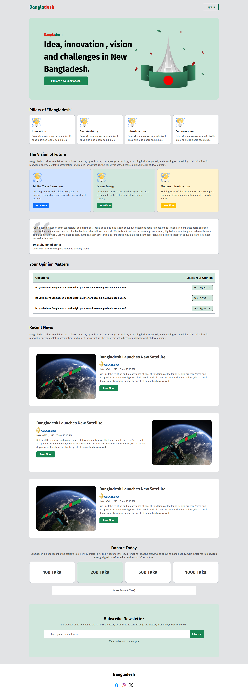

# Bangladesh — Single Page Website

[🔗 Live Demo](https://bangladesh-eta.vercel.app/)

**Bangladesh** is a beautifully crafted **single-page website** designed to represent the culture, beauty, and identity of Bangladesh. Built using **HTML**, **Bootstrap 5**, and **custom CSS**, this responsive website highlights different aspects of the country in a clean and modern layout.

---

## ✨ Features

- ✅ Fully responsive design (mobile, tablet, desktop)
- ✅ Smooth layout with Bootstrap Grid and Flex utilities
- ✅ Sections like hero banner, vision, news, and footer
- ✅ Clean and minimal user interface
- ✅ Custom CSS used for styling beyond Bootstrap
- ✅ Hosted on Vercel for fast and free deployment

---

## 🛠️ Tech Stack

| Technology   | Description                                  |
|--------------|----------------------------------------------|
| HTML5        | Page structure and content                   |
| Bootstrap 5  | Layout, grid system, responsive utilities    |
| CSS3         | Custom styles and visual enhancements        |
| Vercel       | Hosting and deployment platform              |

---

## 📁 Folder Structure
bangladesh/
├── assets/
│ └── logo/ # Website logos or favicon
├── css/
│ └── style.css # Custom CSS styles
├── images/ # Image files
├── index.html # Main HTML file
└── README.md # Project documentation


---

## 📸 Screenshots

| Hero Section | Footer |
|--------------|--------|
|  |  | 

---

## 🚀 How to Run Locally

1. **Clone the repository**
   ```bash
   git clone https://github.com/devo-ab/bangladesh.git
   cd bangladesh

👤 Author
Avi Jit
🌐 Live Website
