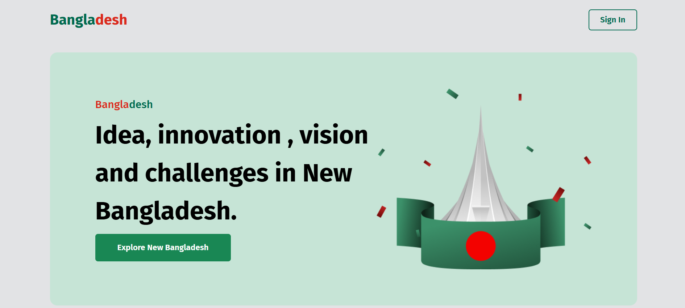
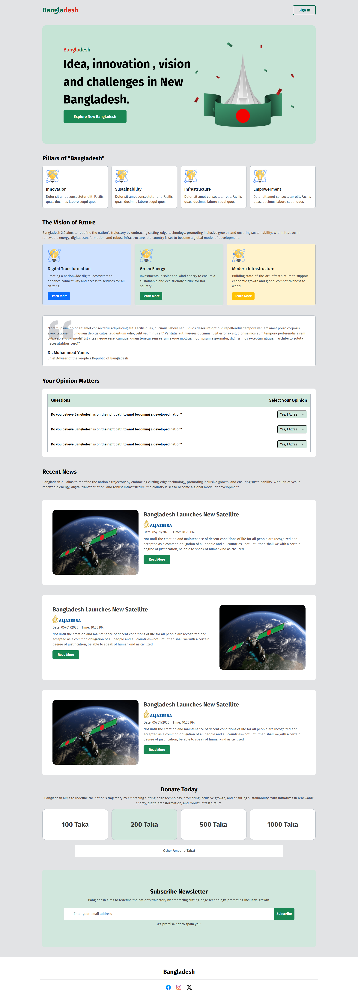

# Bangladesh — Single Page Website

[🔗 Live Demo](https://bangladesh-eta.vercel.app)

**Bangladesh** is a beautifully crafted **single-page website** designed to represent the culture, beauty, and identity of Bangladesh. Built using **HTML**, **Bootstrap 5**, and **custom CSS**, this responsive website highlights different aspects of the country in a clean and modern layout.

---

## ✨ Features

- ✅ Fully responsive design (mobile, tablet, desktop)
- ✅ Smooth layout with Bootstrap Grid and Flex utilities
- ✅ Sections like hero banner, vision, news, and footer
- ✅ Clean and minimal user interface
- ✅ Custom CSS used for styling beyond Bootstrap
- ✅ Hosted on Vercel for fast and free deployment

---

## 🛠️ Tech Stack

| Technology  | Description                               |
| ----------- | ----------------------------------------- |
| HTML5       | Page structure and content                |
| Bootstrap 5 | Layout, grid system, responsive utilities |
| CSS3        | Custom styles and visual enhancements     |
| Vercel      | Hosting and deployment platform           |

---

## 📁 Folder Structure

```
bangladesh/
├── assets/
│   ├── images/             # All image files used in the website
│   ├── logo/               # Logo files
├── css/                    # Stylesheets (style.css)
├── preview/                # Screenshots for README
├── index.html              # Main landing page
└── README.md               # Project documentation
```
---

## 📸 Screenshots

### 🖼️ Hero Section


### 🖼️ Full Preview


---

## 🚀 How to Run Locally

1. **Clone the repository**
   ```bash
   git clone https://github.com/devo-ab/bangladesh.git
   cd bangladesh
   ```

# 👤 Author

# Avi Jit

## :mailbox: Reach me out

<p align="left">
<a href="https://linkedin.com/in/itsavijitb" target="blank"></a>
<a href="https://twitter.com/itsavijitb" target="blank"></a>
<a href="https://facebook.com/itsavijitb" target="blank"></a>
<a href="https://instagram.com/itsavijitb" target="blank"></a>
</p>
